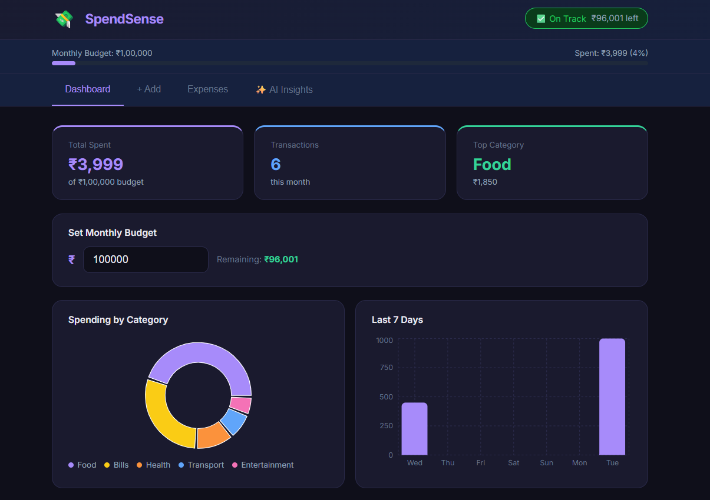
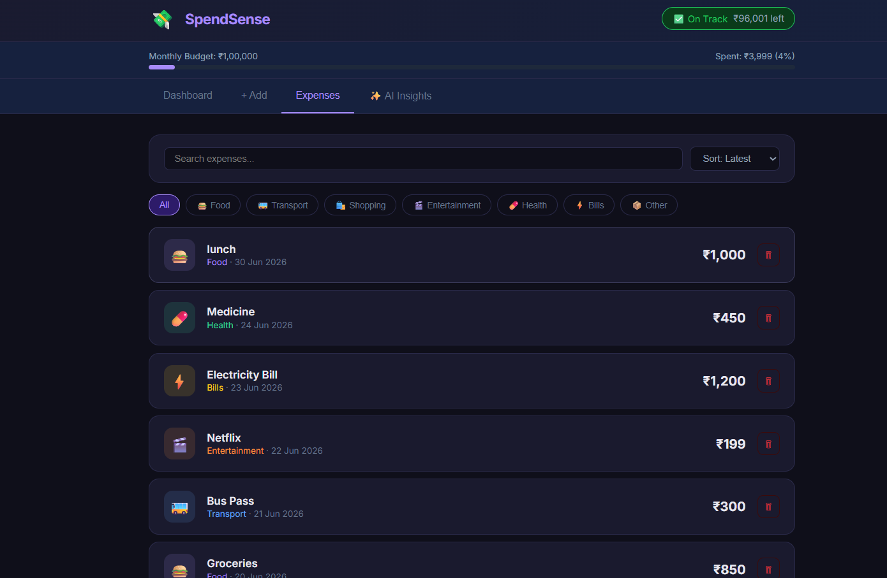
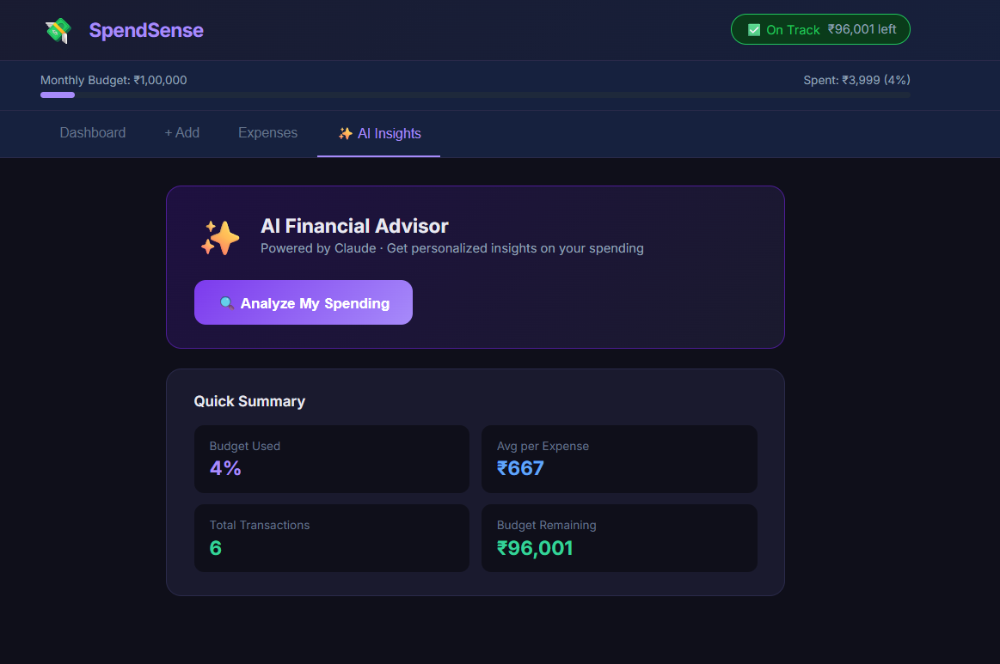

# 💸 SpendSense — AI-Powered Expense Tracker

> A full-stack web application that helps users track expenses, visualize spending patterns, and receive AI-generated financial insights.

## 🌐 Live Demo
[View Live on Vercel](https://spendsense-expense-tracker-nine.vercel.app)

> ✅ **AI Insights are fully functional on the live demo!** The backend is deployed on Render and connected to the frontend automatically.

## 📸 Screenshots

**Dashboard**


**Expenses List**


**AI Insights**


---

## 🚀 Features

- **📊 Interactive Dashboard** — Real-time pie chart and bar chart showing spending by category and daily trends
- **➕ Expense Management** — Add, filter, search, sort, and delete expenses with a clean UI
- **💰 Budget Tracker** — Set monthly budget with a live progress bar and over-budget alerts
- **✨ AI Financial Advisor** — Get personalized spending insights powered by AI
- **💾 Persistent Storage** — Data saved to localStorage, persists across sessions
- **📱 Responsive Design** — Works on desktop and mobile

---

## 🛠️ Tech Stack

| Layer | Technology |
|---|---|
| Frontend | React 18 + Vite |
| Styling | Pure CSS-in-JS (no framework) |
| Charts | Recharts |
| Backend | Node.js + Express (proxy server) |
| AI Integration | Groq API (LLaMA 3.3 70B) |
| Frontend Deployment | Vercel |
| Backend Deployment | Render |

---

## 🧠 Problem Statement

People struggle to track their daily expenses manually and often overspend without realizing it. SpendSense solves this by providing:
1. A fast, intuitive way to log expenses
2. Visual breakdowns to understand spending patterns
3. AI-powered advice to make better financial decisions

---

## 💡 Key Technical Decisions

- **localStorage for data** — keeps expense/budget data fast and simple, no database needed
- **Express backend proxy** — a lightweight Node.js server (`server.js`) securely calls the Groq AI API so the API key never reaches the browser
- **Groq AI integration** — sends an expense summary to Groq's LLaMA 3.3 model and renders personalized financial insights
- **Recharts for visualization** — lightweight, responsive charts with custom dark theme
- **Component architecture** — modular React components (Dashboard, ExpenseForm, ExpenseList, AIInsight)

---

## 📦 Installation & Running Locally

This project has two parts: the **React frontend** and a small **Express backend** (for the AI feature). Run both:

```bash
# Clone the repo
git clone https://github.com/lalasa496/spendsense-expense-tracker.git
cd spendsense-expense-tracker/expense-tracker

# Install dependencies
npm install
```

**Terminal 1 — Start the backend (for AI Insights):**
```bash
node server.js
```

**Terminal 2 — Start the frontend:**
```bash
npm run dev
```

Open [http://localhost:5173](http://localhost:5173)

---

## 🚀 Deployment

- **Frontend** → Vercel: [https://spendsense-expense-tracker-nine.vercel.app](https://spendsense-expense-tracker-nine.vercel.app)
- **Backend** → Render: [https://spendsense-backend-tusn.onrender.com](https://spendsense-backend-tusn.onrender.com)

> Note: Render's free tier may take 30-50 seconds to wake up after inactivity on the first AI request.

---

## 🔑 AI Feature Setup

The AI Insights feature uses the **Groq API** (free tier, no credit card required). The backend is deployed on Render and reads the API key securely from environment variables.

To run locally:
1. Get a free key at [console.groq.com](https://console.groq.com)
2. Set it as an environment variable or paste it in `server.js`
3. Run `node server.js`

---

## 👤 Author

**Lalasa** — SkillBolt Internship Program Submission

---

## 📁 Project Structure

```
expense-tracker/
├── server.js             # Express proxy server for Groq AI calls
├── src/
│   ├── App.jsx           # Main app with routing & state
│   ├── components/
│   │   ├── Dashboard.jsx    # Charts & budget overview
│   │   ├── ExpenseForm.jsx  # Add expense form
│   │   ├── ExpenseList.jsx  # Filter, search, list expenses
│   │   └── AIInsight.jsx    # AI advisor integration (Groq)
```
